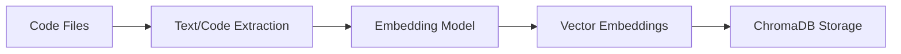
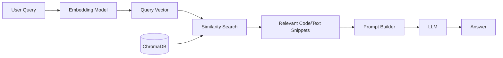

# 🧠 AI Service

The **AI Service** is a core component designed to enable semantic codebase search and intelligent Q&A over your source code. It bridges the gap between natural language queries and code understanding by leveraging embeddings, a vector database (ChromaDB), and fast search interfaces. The service allows users to ask questions about their codebase and receive context-aware answers powered by large language models (LLMs).

## Current Functionalities

- **Semantic Search:** Uses code embeddings to find relevant code snippets in the project for a given natural language question.
- **Intelligent Q&A:** Synthesizes answers to user questions by combining information from multiple relevant code snippets and LLM reasoning.
- **ChromaDB Integration:** Stores and queries code embeddings for fast and accurate retrieval.
- **Dynamic Prompting:** Adjusts the prompt sent to the LLM based on the relevance and number of code snippets found.

## Architecture Overview

### 1. Code Ingestion Process



### 2. Query & Answer Process



## Layers

- [Chunking](./src/ai_service/chunking/README.md): is responsible for preprocessing code files into manageable segments before embedding.
- [Embeddings](./src/ai_service/embeddings/README.md): layer responsible for converting code and natural language queries into high-dimensional vectors that capture semantic meaning.
- [Vector DB](./src/ai_service/db_setup/README.md): layer responsible for managing ChromaDB operations for storing and querying code embeddings (semantic search).

## Examples

- For local development you need to start the applicatio: `make start`.
- For testing the container you have to build and start it:

 ```bash
 docker compose build ai-service 
 docker compose up -d --wait ai-service 
 ```

### HTTP

You can check the [HTTP Requests](requests.http) for http examples.

### CURL

- Ingestion endpoint

```curl
curl -X POST http://localhost:8000/ingest \
  -H "Content-Type: application/json" \
  -d '{
    "canonical_github_url": "https://github.com/octocat/Hello-World.git"
}'
```

- Answer endpoint

```curl
curl -X POST http://localhost:8000/answer \
  -H "Content-Type: application/json" \
  -d '{
    "user_question": "How does authentication work in this codebase?",
    "canonical_github_url": "https://github.com/octocat/hello-world.git"
}'
```

```curl
curl -X POST http://localhost:8000/answer \
  -H "Content-Type: application/json" \
  -d '{
    "user_question": "Hello, how are you?"
}'
```
