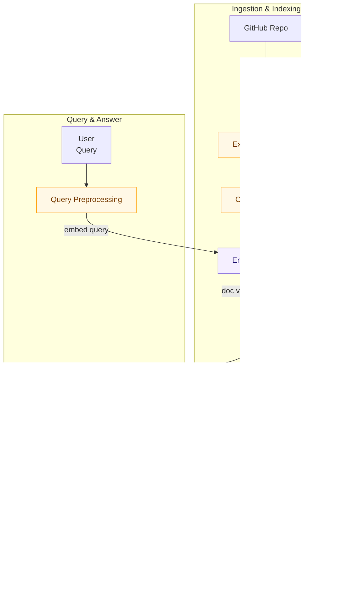

# 🧠 AI Service

The AI service is a core component designed to enable semantic codebase search over source code. It allows github project ingestion and Q&A over it through LLM integration. The LLM can also be used for general purpose communication.

## Core flow

The AI Service follows one cohesive, chronological flow: repository ingestion and indexing (done once per repository or on changes), and query/answer operations (performed per user request). The diagram below shows both paths (ingest and query) and how they connect through the vector store and LLM.



Step-by-step explanation:

### Regarding ingestion

1. Clone Repository: obtain a canonical snapshot of the GitHub repository. This step includes validation of the URL, shallow cloning, and filtering of irrelevant files.

2. File Extraction & Normalization: read source files, normalize encodings, strip irrelevant content and prepare text for chunking. The goal is clean, context-preserving snippets.

3. Chunking strategy: split files into chunks see [chunking section](./src/ai_service/chunking/).

4. Embedding strategy: convert each chunk into a high-dimensional vector using the project embedding encoder. Embeddings are also used for query vectors. See [embeddings section](./src/ai_service/embeddings/README.md).

5. Vector DB: store vector embeddings and related metadata into ChromaDB. See [vector db section](./src/ai_service/db_setup/README.md).

### Regarding Q&A

1. Query Preprocessing & Embed Query: for each user question, apply light normalization and then compute the query embedding with the same embedding model used during ingestion.

2. Similarity Search: query ChromaDB for nearest neighbors, returning the top-N most relevant chunks along with metadata and similarity scores.

3. Prompt Building: assemble a compact prompt for the LLM using the highest-quality retrieved snippets, metadata (for citations), and a task-specific instruction. The service applies dynamic prompting to control token budgets and reduce hallucinations.

4. LLM Answering: send the constructed prompt to the configured [LLM](./src/ai_service/ollama_client.py) and get an answer back based on the instructions given.

## Layers

- [Chunking](./src/ai_service/chunking/README.md): is responsible for preprocessing code files into manageable segments before embedding.
- [Embeddings](./src/ai_service/embeddings/README.md): layer responsible for converting code and natural language queries into high-dimensional vectors that capture semantic meaning.
- [Vector DB](./src/ai_service/db_setup/README.md): layer responsible for managing ChromaDB operations for storing and querying code embeddings (semantic search).
- [LLM](./src/ai_service/ollama_client.py): Layer responsible for interacting with LLM.

## Examples

- Using Make (local development):

```bash
make start
```

- Using Docker Compose:

```bash
docker compose build ai-service
docker compose up -d --wait ai-service
```

### HTTP

You can check the [HTTP Requests](requests.http) for http examples.

### CURL

- Ingestion endpoint

```bash
curl -X POST http://localhost:8000/ingest \
  -H "Content-Type: application/json" \
  -d '{
    "canonical_github_url": "https://github.com/octocat/Hello-World.git"
  }'
```

- Ask a question (with repository context)

```bash
curl -X POST http://localhost:8000/answer \
  -H "Content-Type: application/json" \
  -d '{
    "user_question": "How does authentication work in this codebase?",
    "canonical_github_url": "https://github.com/octocat/Hello-World.git"
  }'
```

- Ask a general question (no repo)

```bash
curl -X POST http://localhost:8000/answer \
  -H "Content-Type: application/json" \
  -d '{
    "user_question": "Hello, how are you?"
  }'
```

The tests in `tests/` include integration tests that exercise embeddings and the LLM/search pipeline.
